# Chunk 1: Building the frontend

* Step 1 , 2 , 3 : I am too lazy to create in HTML, CSS so I decided using ChatGPT to do my portfolio in VueJS
* Step 4: I create a S3 with following configuration:
    * Turn off Block all public access
        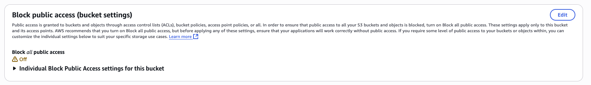
    * Setup Bucket policy : allow all user access to bucket and itsobjects
    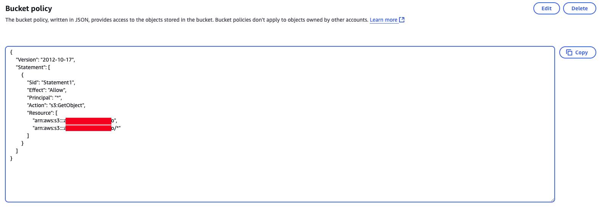
    * Turn on "Static website hosting"
    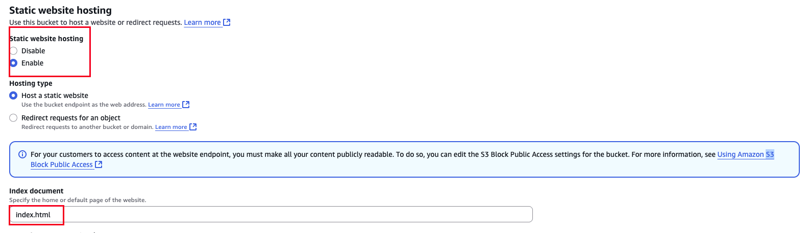
    * Access to link 
    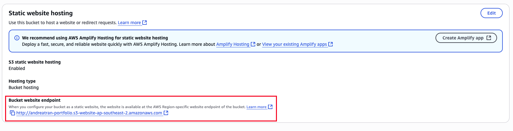
    * Result
    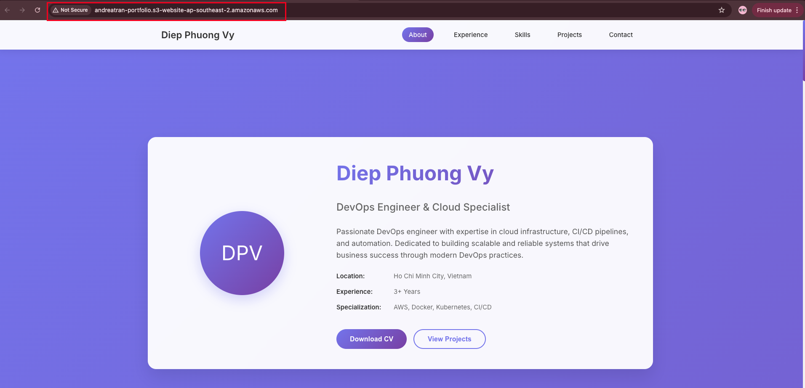
* Step 5: Next, setup https dns 
    * Turn off "Static website hosting" due to security issue and wewant to use Cloudfront as our public access link
    * Create Cloudfront distribution, choose S3 as the Origin path
    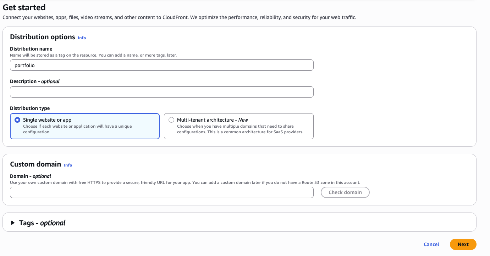
    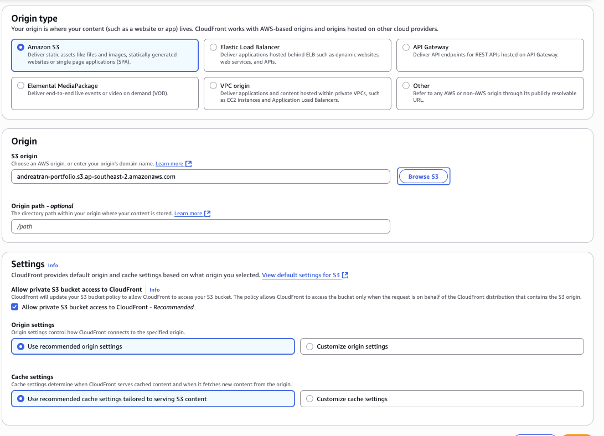
    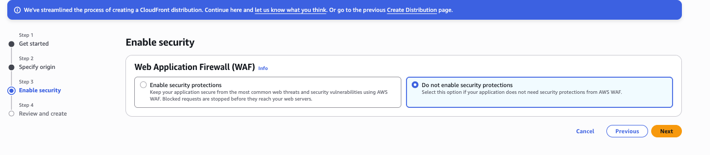
    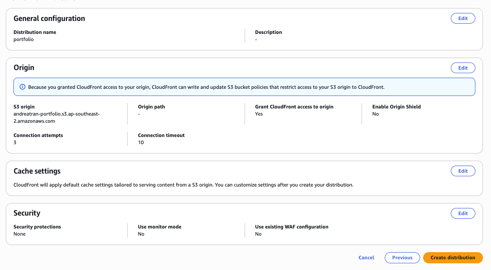
    * Remember to set Default root object or you will get "Access Denied"
    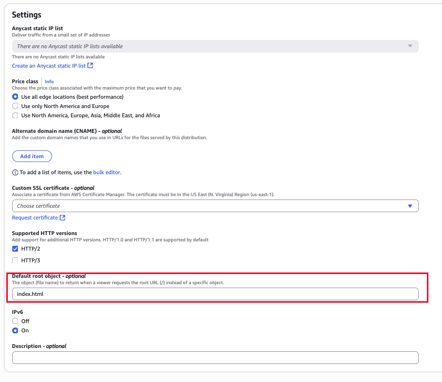
    * Result
    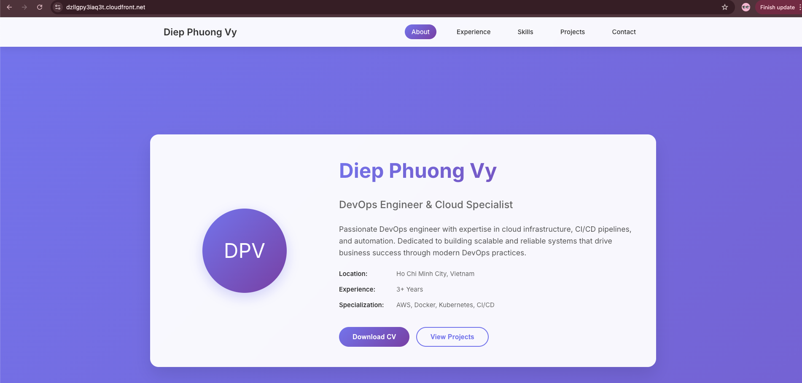
    * Next configures domain in cloudfront
    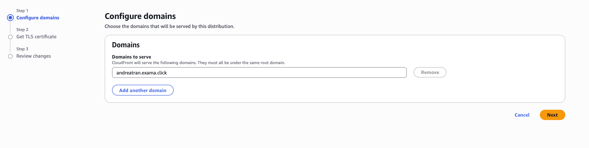
    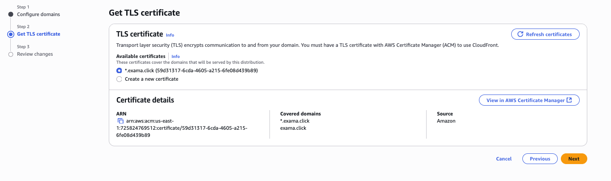
    * Create record alias to Cloudfront
    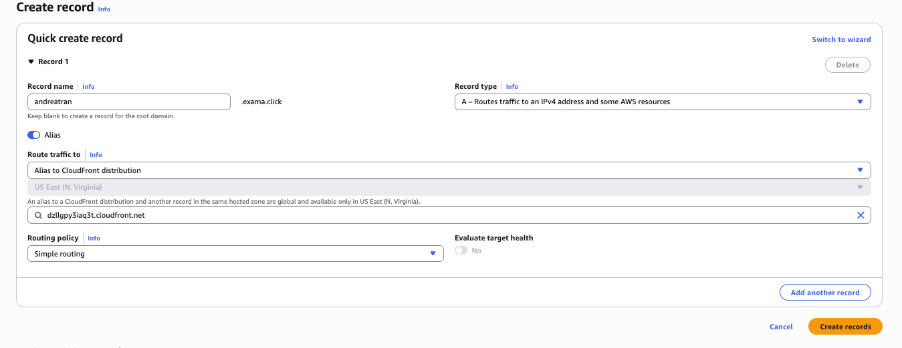
    * Result
    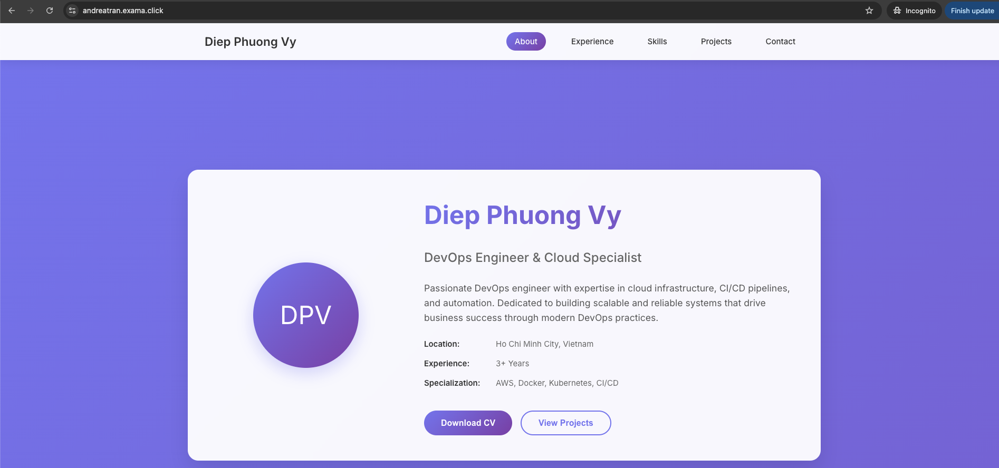

* Advanced: 
    