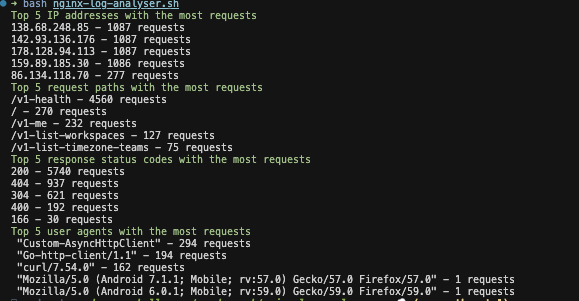

## Requirement
You are required to create a shell script that reads the log file and provides the following information:

* Top 5 IP addresses with the most requests
* Top 5 most requested paths
* Top 5 response status codes
* Top 5 user agents

## Use
``` bash
chmod +x nginx-log-analyser.sh

bash nginx-log-analyser.sh access_nginx.log 
# or 
bash nginx-log-analyser.sh


```

## Result 
